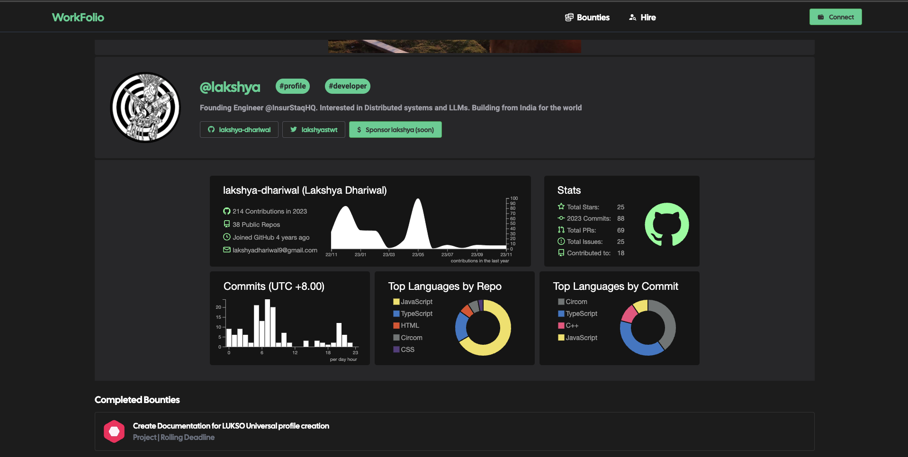
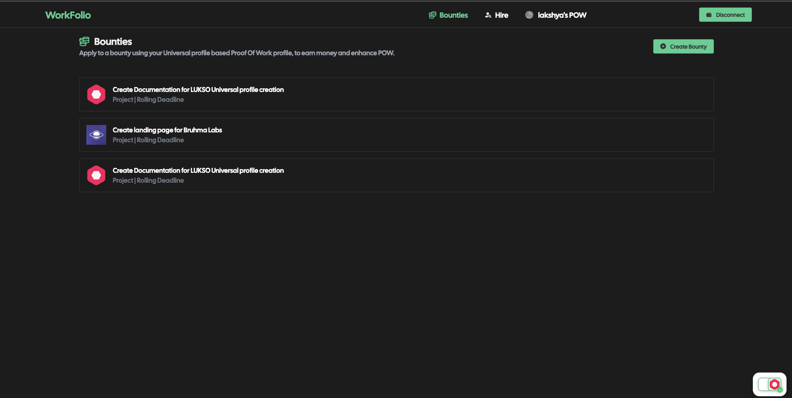
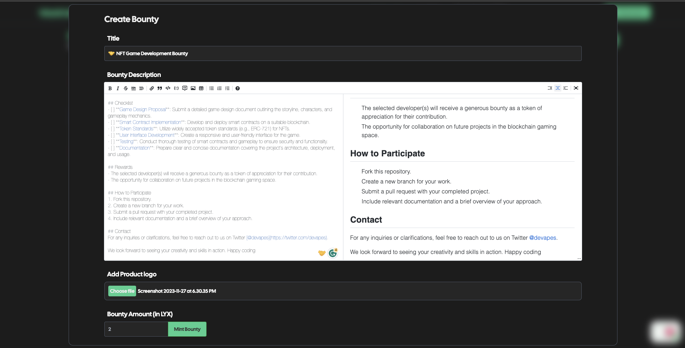
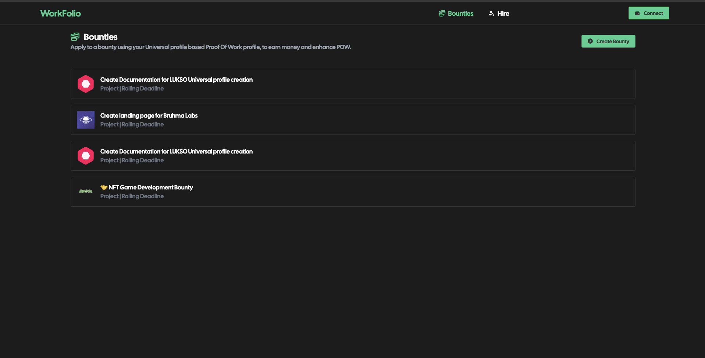
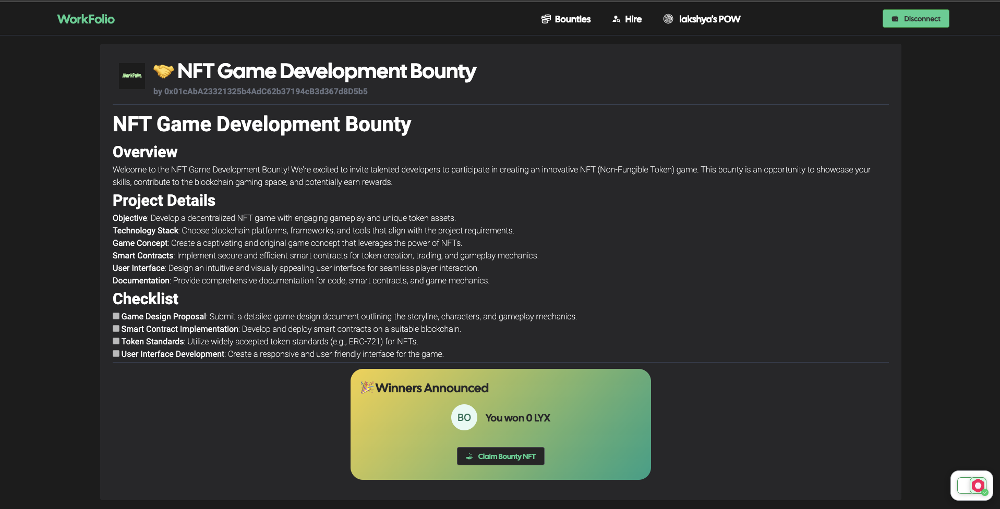
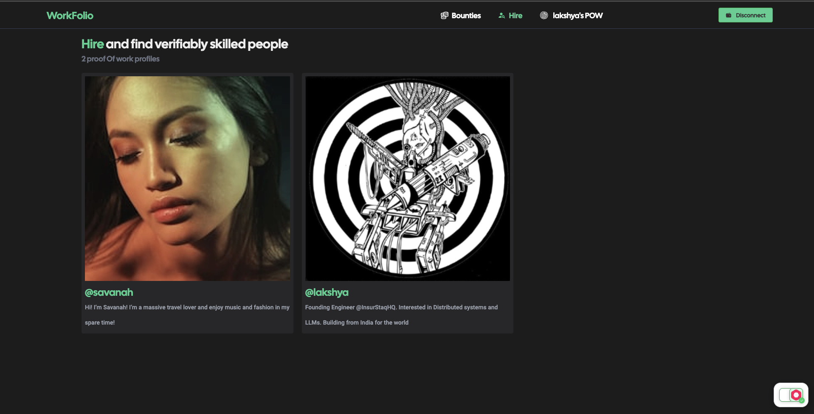

# WorkFolio

> Leverage Proof of Work Profiles to Secure Bounties and Unlock Job Offers with Verifiable Skills !

---

## Features

Build Your Proof of Work Profile

: Create a comprehensive Proof of Work profile, showcasing your skills, projects, and completed bounties to stand out in the job market.

Win Lucrative Bounties
: Compete and secure bounties by leveraging your verified Proof of Work profile, demonstrating your expertise and increasing your chances of success.

Apply with Proof of Work
: Streamline the application process by submitting your Proof of Work profile, offering potential employers an instant and credible overview of your skills.

Discover Verifiable Talent
: Easily find skilled individuals with validated capabilities by exploring Proof of Work profiles, ensuring a match for your project needs

Sponsor People
: Facilitate direct monetary appreciation for exceptional work by enabling users to send tips through Proof of Work profiles.

Skill Recognition with Karma
: Move beyond traditional credentials with the ==Karma Engine==, where community-driven endorsements offer authentic recognition of a skills.

| Contract    | Standard | Link                                                                                                                                    |
| ----------- | -------- | --------------------------------------------------------------------------------------------------------------------------------------- |
| Sponsor Dev | LSP17    | [Lukso Testnet](https://explorer.execution.testnet.lukso.network/tx/0xf6554cabe91ca08f9ae59e872f5a64c1964945ec4f26006253bb7b141a7740ce) |
Bounty NFT | LSP8 | [Github](https://github.com/pratham-bhatnagar/WorkFolio/blob/8243814a5a6094e5c6794b1eceb5a4b93f66d2bc/client/src/lib/lukso.tsx#L126)
Winner Claim | LSP8 | [Github](https://github.com/pratham-bhatnagar/WorkFolio/blob/8243814a5a6094e5c6794b1eceb5a4b93f66d2bc/client/src/lib/lukso.tsx#L126)

## Screens

> Landing Page

> Proof of Work Profile

> ALL Bounty Page

> Create Bounty Page

> Created Bounty 

> Bounty Page

> Hire Page

